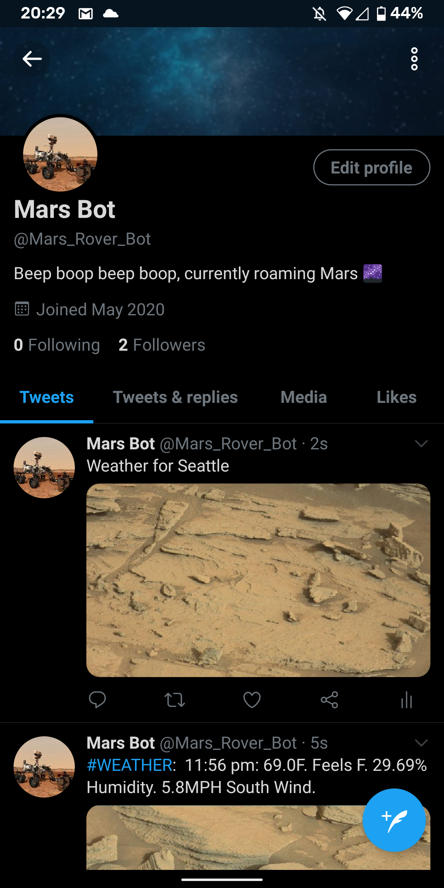

# Rover-Bot
<p align="center">
   
</p>
Rover Bot is an Twitter bot I coded up primarily in Go. Rover Bot works by implementing 2 APIS. First, a random image is selected from the NASA Mars Rover API and downloaded, next a phrase is generated from a dataset gathered from Twitter. The Twitter data set contains over 10,000 cleansed phrases revolving under the subject matter of weather. After both the image and the caption are created, a connection to the Twitter API is established in Python and the JSON object is sent using the REST API.

## Environment Variables
To alleviate the security concerns surrounding API keys and client secrets I have implemented evironment variables. These variables are set before the execution of the main program and act as arguments for the program. In Linux and MacOS these environment variables can be set like so (in Windows replace the "export" keyword with "set"):
```
$ export CONSUMER_KEY=VALUE
$ export CONSUMER_SECRET=VALUE
$ export ACCESS_TOKEN=VALUE
$ export ACCESS_TOKEN_SECRET=VALUE
```
## Getting Started
```
$ pip install -r install/requirements.txt
$ go run src/rover-bot/main.go
```
## Author
* Solomon Heisey


 
 
